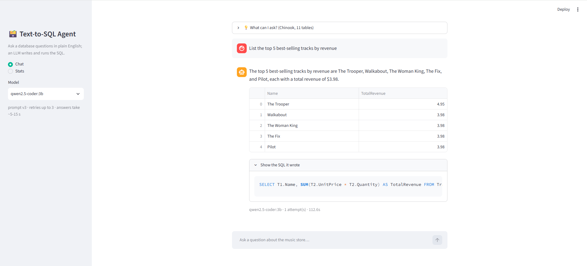
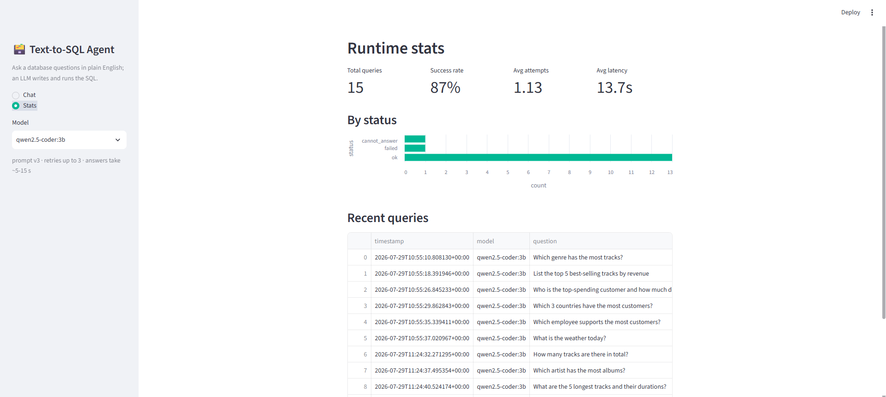

# text-to-sql-agent

Ask a database questions in plain English. A local LLM (via [Ollama](https://ollama.com))
translates the question to SQL, guardrails validate it, it runs against the database,
and you get a one-sentence answer, the results table, and the SQL itself. Fully local:
no API keys, no cloud, no data leaving the machine.

> **You:** Which 3 countries have the most customers?
> **App:** The three countries with the most customers are the USA, Canada and France.



## Highlights

- **Fully on-device**: runs a 3B model through Ollama with no API keys, no cloud, and
  no data leaving the machine; the whole system fits on a laptop.
- **Agentic self-correction**: it executes its own SQL and feeds the database's error
  messages back to the model to fix mistakes, rather than generating blindly in one shot.
- **Safe by construction**: every query is *parsed into a syntax tree* and constrained
  to a single read-only SELECT, so writes and injection (`SELECT 1; DROP TABLE x`) are
  structurally impossible, not just filtered by keyword. Backed by unit tests.
- **Schema-aware prompting**: the model is shown table definitions, sample rows, the
  exact stored values of low-cardinality columns (so it matches casing like `'usa'`),
  and foreign-key join paths, giving context that measurably improves the SQL it writes.
- **Evaluation-driven**: benchmarked on [Spider](https://yale-lily.github.io/spider)
  with execution accuracy, every experiment versioned in MLflow, and the *reproducible*
  number reported rather than a lucky one-off run.
- **Observable**: a live stats page tracks success rate, retries, and latency per query.

## How it works

```
question → prompt (schema + sample rows + stored-value & join hints + rules)
         → LLM writes SQL → guardrails validate → execute (read-only)
         → on error: feed the DB error back, retry (max 3)
         → results + one-sentence answer
```

Execution accuracy is measured by running both the generated SQL and the reference SQL
and checking they return the same rows (order-invariant); different queries that yield
the same answer both count as correct. An optional **self-consistency mode** (the `--sc`
flag) samples N queries and takes the majority result for a small accuracy boost at ~N×
latency. Off-topic questions ("what's the weather?") are refused.

## Results

Execution accuracy on the Spider dev benchmark (fixed 200-question subset),
single query per question (deterministic, the same every run):

| Model | Accuracy | Off-topic refusal |
|---|---|---|
| **qwen2.5-coder:3b** | **76.0%** | 100% |
| llama3.2:3b | 66.0% | 80% |
| qwen2.5:3b | 65.5% | 100% |
| qwen2.5:1.5b | 52.5% | 85% |

All models run locally on a laptop. `qwen2.5-coder:3b` is the default and is shown
in its shipped configuration (which adds schema foreign-key hints that don't
change its accuracy but raise its off-topic refusal to 100%); the other models are
in the base configuration, so the refusal column is not a like-for-like comparison.

The 76.0% is the reproducible single-query number; self-consistency (below) can
nudge it higher but samples with randomness, so that figure varies run to run.

The app also has a live **runtime stats** page that reads the query log and tracks
success rate, retries, and latency:



## Quickstart

Requires [uv](https://docs.astral.sh/uv/) and Ollama (`ollama pull qwen2.5-coder:3b`).

```bash
uv sync
uv run python eval/download_data.py     # Chinook demo DB + Spider benchmark
uv run streamlit run app.py             # chat UI at http://localhost:8501
```

Reproduce the benchmark (the 76.0% in the table above):

```bash
uv run python eval/make_subset.py                          # build the fixed subset
uv run python eval/run_eval.py --model qwen2.5-coder:3b    # run + log to MLflow
uv run mlflow ui                                           # view results
```

Add `--sc 3` to enable self-consistency (majority vote over 3 samples): ~76–78%
accuracy at ~3× the latency.

## Structure

```
src/text2sql/    llm client, schema extraction, prompts, guardrails, agent loop
app.py           Streamlit UI (chat + runtime stats)
eval/            benchmark harness, result comparison, off-topic probes
tests/           unit tests (guardrail cases run without an LLM)
config.yaml      all settings in one place
```

## Design notes

- **Verifiable, not a black box**: the generated SQL is always shown alongside the
  answer, so results can be checked; built as an analyst-assist tool.
- **Deliberately focused**: a single agent in plain Python (no framework), local-first
  by design. A Dockerfile covers packaging; CI runs lint and tests on every push.
- **~1 in 4 answers is still wrong** at this scale, which is why the SQL is always
  visible; it is honest about being a 3B-on-a-laptop system, not a production oracle.
